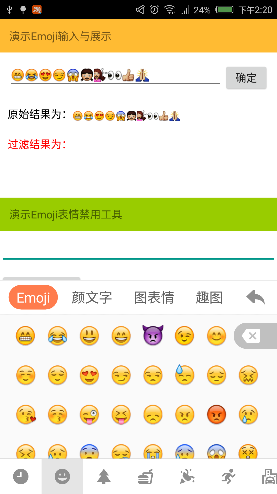

# EmojiMaster
搜狗Emoji表情输入、展示、过滤、禁用等功能实现。

### 运行效果

<a href="./art/Screenshot.png"></a>


### 联系我

新浪微博：[@leafseelight](http://weibo.com/leafseelight)

Email：ye.jg@outlook.com


##### 如能荣幸给您带来帮助，并且乐意的话，可以在Demo中关于我的界面，支持一下我→ 微信or支付宝

### Thanks
 
 * [https://github.com/fython/AlipayZeroSdk](https://github.com/fython/AlipayZeroSdk)

### License

```
Copyright 2016 leafseelight

Licensed under the Apache License, Version 2.0 (the "License");
you may not use this file except in compliance with the License.
You may obtain a copy of the License at

    http://www.apache.org/licenses/LICENSE-2.0 
    
Unless required by applicable law or agreed to in writing, software
distributed under the License is distributed on an "AS IS" BASIS,
WITHOUT WARRANTIES OR CONDITIONS OF ANY KIND, either express or implied.
See the License for the specific language governing permissions and
limitations under the License. 
```